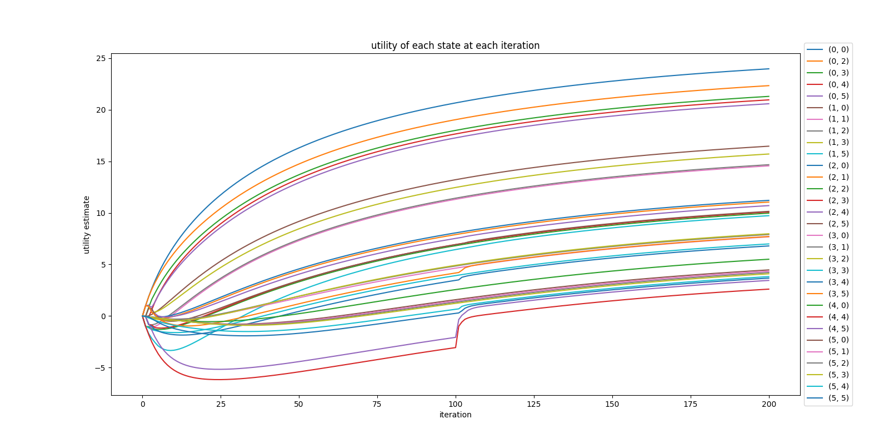

# assignment 1

## given maze

## directory content

- `references/`: contains reference material (e.g. instructions, algorithms)
- `results/`: contains results of assignment 1
- `algorithms.py`: defines reinforcement algorithms taught in this module
- `base.py`: defines base classes (only `MarkovDecisionProcess` currently)
- `config.py`: defines constants and configurations to be used
- `grid.py`: defines a function for generating random grids (for bonus questions)
- `maze.py`: defines a maze environment (inherits from `MarkovDecisionProcess`)
- `plot.py`: defines function to plot graphs

## assumptions

- borders of the maze can be attempted to be moved into, just like walls
- only 1 best action to take at any given state

## plots of utilities versus iterations

### value iteration on given maze (discount = 0.99, max_error = 20)

### value iteration (discount = 0.95, max_error = 1.4)

### policy iteration (discount = 0.99, num_policy_evaluation = 100)

### value iteration on bonus maze (discount = 0.99, max_error = 20)

### policy iteration on bonus maze (discount = 0.99, max_error = 20)

